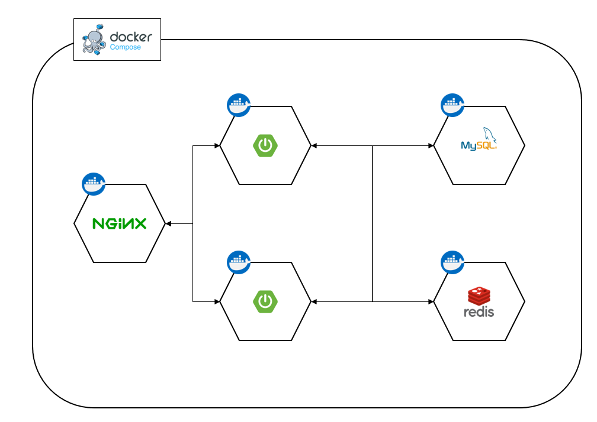

# playground

## 목표
redis를 이용하여 세션 클러스터링 구현해보기  
세션을 이용한 로그인 구현 시 다중 서버에서 발생하는 세션 불일치를 해결하기 위한 공부

## 구현
도커 컴포즈를 이용하여 다중 서버 구성 및 DB, redis 서버를 컨테이너로 띄운 뒤 테스트를 통해 세션 공유가 정상적으로 되는지 확인.

## 결과
로그인 한 뒤 새로 고침 시 서버가 바뀌었지만 로그인은 유지되는 것을 확인

## 아키텍쳐


## 실행 방법
```text
1. git clone
2. docker build
  2-1. src/main/resources/templates/index.mustache 의 9번라인(<h2>서버 2</h2>) 내용 변경
  2-2. 커맨드 실행(docker build -t spring-server2 .)
  2-3. 서버 1의 경우 spring-server1 로 이미지명 변경
3. 커맨드 실행(docker-compose up -d)
4. http://localhost 로 접속하여 계정 추가 및 로그인 하여 세션 공유 확인
```

**nginx 오류 발생 시**  
nginx/nginx.conf 의 upstream tomcat 설정에서 컨테이너 명을 개인 ip로 변경