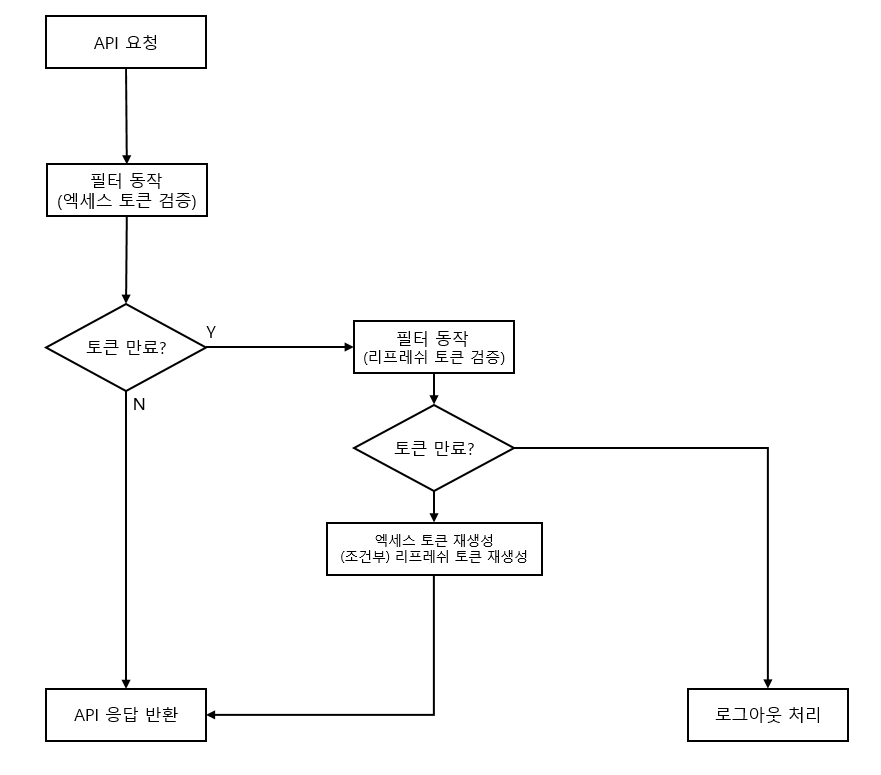

# playground

## 목표
1. 로그인 시 토큰 생성 및 반환  
2. 토큰을 이용한 인증, 인가 구현  
3. 엑세스 토큰 만료 시 리프레쉬 토큰을 이용하여 새로운 토큰 발급 및 반환

## 흐름도(flow chart)

## 토큰 특징
* 엑세스 토큰
  * 만료시간 - 30분
  * API 요청 시 header의 Authorization 에 Bearer 토큰으로 요청됨
  * 리프레쉬 토큰을 이용하여 재생성 시 header의 Authorization 담겨 반환됨
* 리프레쉬 토큰
  * 만료시간 - 7일
  * 하나의 토큰으로 엑세스토큰을 총 5번 재발급 가능
  * 5번의 재발급 후에 새로운 리프레쉬 토큰 생성
  * Cookie를 통해 통신(secure, HttpOnly)

## API정의서
|  API명   |    엔드포인트    | method |                header(cookie 포함)                 |               requestBody                |       response       |
|:-------:|:-----------:|:------:|:------------------------------------------------:|:----------------------------------------:|:--------------------:|
|  계정 생성  | /auth/join  |  post  |                       none                       |                   none                   |ResponseDTO.success() |
|   로그인   | /auth/login |  post  |                       none                       | {username: string,  password: string} |성공 시 - ResponseDTO.success(TokenDTO)   실패 시 - ResponseDTO.fail()|
| 테스트 API | /test/get |  get   | header - Authorization cookie - refresh_token |                   none                   |ResponseDTO|
